# AR/MR技术
由于2018版本后的Vuforia系统变成了unity的一部分模块，我们在最开始安装unity的时候可以直接下载，如果没有下载，可以在unityHUb中下载相应模块：
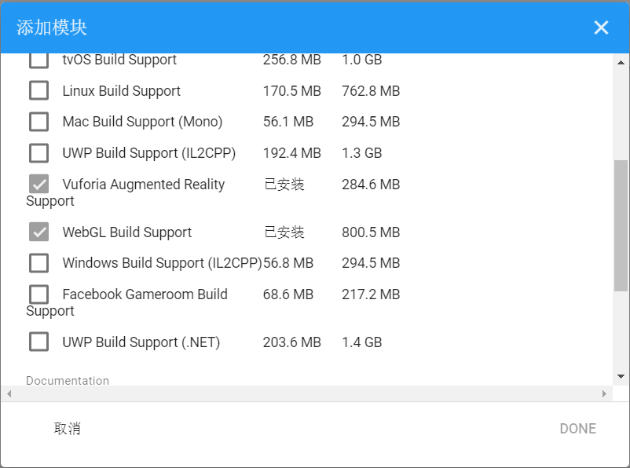

vuforia官网：
<https://developer.vuforia.com/>
* 进入官网之后，首先注册登录，进入Develop页面，选择Get Development Key,创建证书，获取License Key：
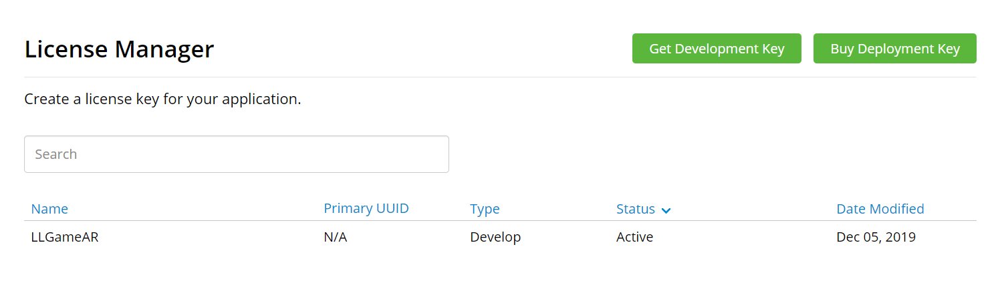

* 打开刚才创建的证书，复制证书
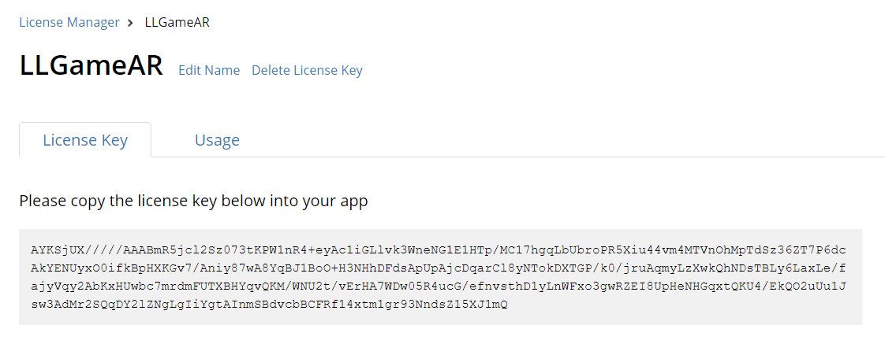
* 打开3d unity创建新项目，选择GameObject --> vuforia engine-->AR Camera. 删去Main Camera,选择AR Camera,在试图中打开Open Vuforia Engine configuration,将证书粘贴到App License Key中。
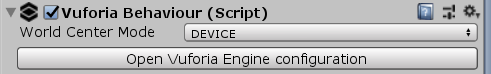
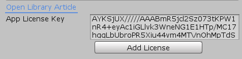

* 进入TargetManager页面。上传图片，添加数据库，下载数据库：
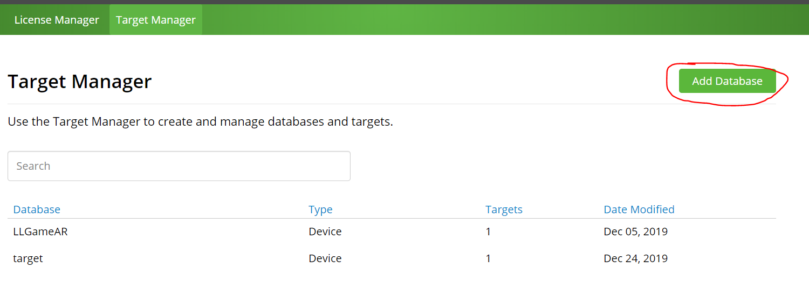
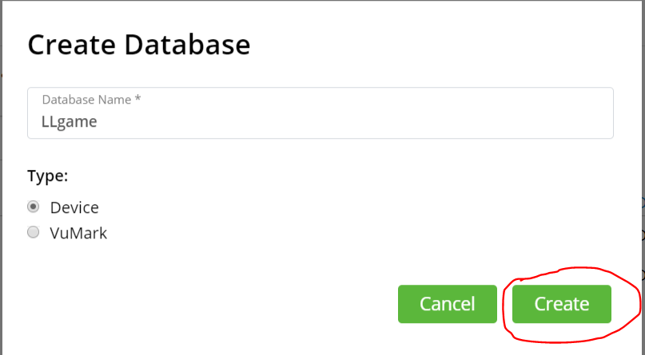
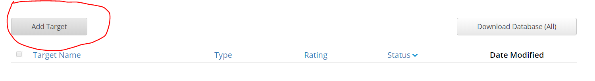
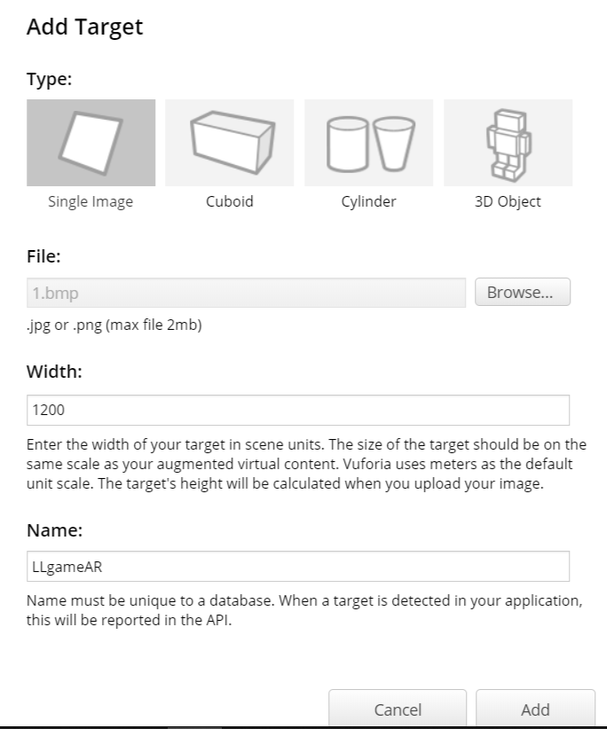
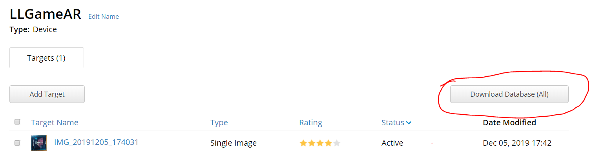
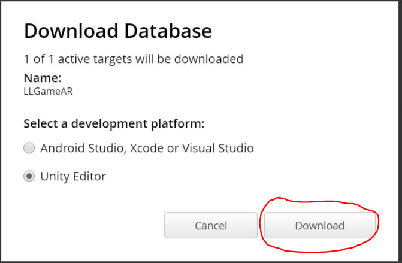
* 导入到3d unity内。
* 导入你要的模型预制
* 选择 GameObject -->vuforia engine -->Image 创建ImageTarget.
* 将预制模型拖到ImageTarget中
* 点击ImageTarget，在试图中找到并点击Add Virtual Button键，添加按钮。
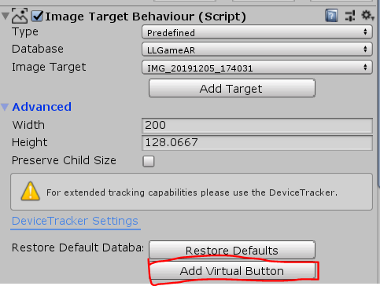

* 在VirtualButton中添加Sphere,使按钮可视化。
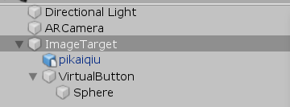
* 调参，使得模型在数据基上方，并且使得模型大小适中，且出现在在Camera Preview中
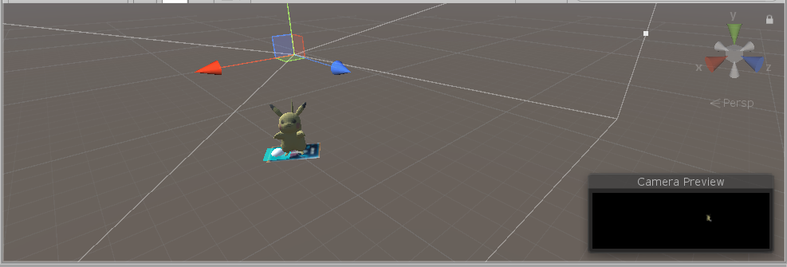
* 在ImageTarget中，将Database改为你导入的数据基，更改Image Target。
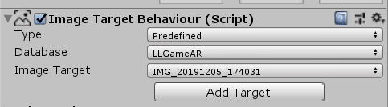
* 添加脚本move.cs,使得模型点击按钮移动
~~~java
using System.Collections;
using System.Collections.Generic;
using UnityEngine;
using Vuforia;
public class move : MonoBehaviour, IVirtualButtonEventHandler
{
    public GameObject vb;
    enum direction {top, bottom, left,right};
    public GameObject pikaqiu;
    static int num = 0;
    Vector3 newPosition;
    void Start()
    {
        //注册事件处理器
        VirtualButtonBehaviour vbb = vb.GetComponent<VirtualButtonBehaviour>();
        //在虚拟按钮中注册TrackableBehaviour事件

        if (vbb)
        {
            Debug.Log("register OK!");
            vbb.RegisterEventHandler(this);
        }
    }

    public void  OnButtonPressed(VirtualButtonBehaviour vb)
    {

        Debug.Log("Pressed");
        pikaqiu.transform.localPosition += new Vector3(0f, 0.1f, 0f);
        num++;
        Debug.Log(num - 1);
    }

   public void OnButtonReleased(VirtualButtonBehaviour vb)
    {
        Debug.Log("released");
    }

}

~~~

* 将脚本挂载到ImageTarget上，提前拖入预制：
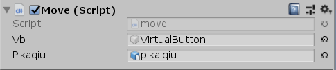

* 点击运行，运行效果如下：
  