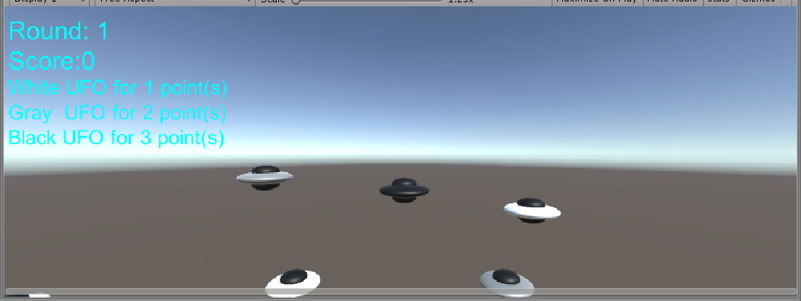
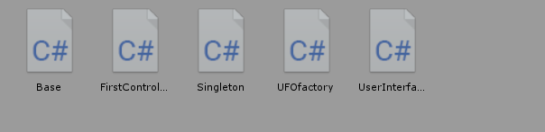
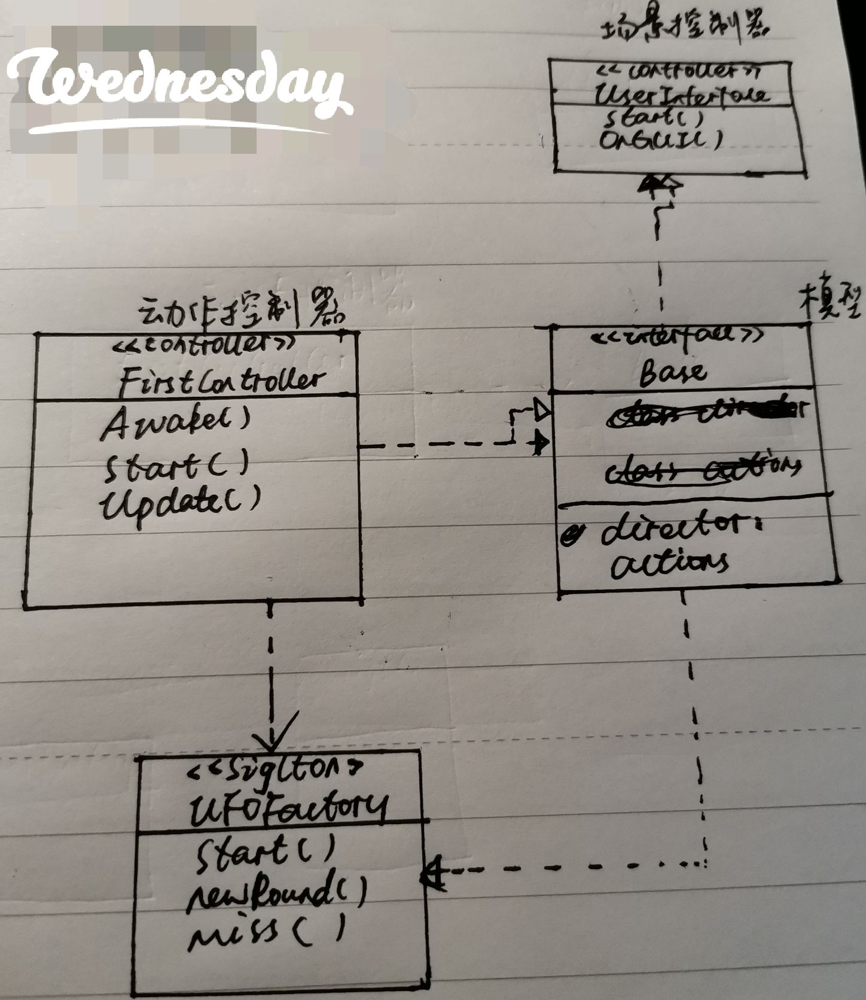

## Unity实现简易打飞碟
>作业与练习 
>1、编写一个简单的鼠标打飞碟（Hit UFO）游戏 
>游戏内容要求： 
游戏有 n 个 round，每个 round 都包括10 次 trial; 
每个 trial 的飞碟的色彩、大小、发射位置、速度、角度、同时出现的个数都可能不同。它们由该 round 的 ruler 控制； 
每个 trial 的飞碟有随机性，总体难度随 round 上升；
鼠标点中得分，得分规则按色彩、大小、速度不同计算，规则可自由设定。 
游戏的要求： 
使用带缓存的工厂模式管理不同飞碟的生产与回收，该工厂必须是场景单实例的！具体实现见参考资源 Singleton 模板类 
>近可能使用前面 MVC 结构实现人机交互与游戏模型分离

首先看下界面:(动图太大，无法加载)

规则如下： 
1.三种飞碟，灰黑白，分别代表三种分数，打中得到相应分数。
2.游戏共9轮，没有失败限制。第9轮结束显示最终分数。

项目代码结构

以及UML图：

各部分代码解释：
~~~java
//Singleton.cs
using System.Collections;
using System.Collections.Generic;
using UnityEngine;

public class Singleton<T> : MonoBehaviour where T: MonoBehaviour
{
	protected static T instance;
	public static T Instance
	{
		get
		{
			if (instance == null)
			{
				instance = (T)FindObjectOfType(typeof(T));
				if (instance == null)
				{
					Debug.LogError("No instance of " + typeof(T));
				}
			}
			return instance;
		}
	}
}
~~~
场景单实例类，当所需的实例第一次被需要时，在场景内搜索该实例，下一次使用时不需要搜索直接返回。

~~~java
//FirstController.cs
using System.Collections;
using System.Collections.Generic;
using UnityEngine;
using Base;

public class FirstController : MonoBehaviour
{
	public UFOfactory factory;
	public director director;
	private GameObject myUFOfactory;
	public GameObject _camera;

	void Awake()
	{
		Random.InitState((int)System.DateTime.Now.Ticks);
		myUFOfactory = new GameObject("UFOfactory");
		myUFOfactory.AddComponent<UFOfactory>();
		director = director.getInstance();
		factory = Singleton<UFOfactory>.Instance;
		director.currentController = this;
	}

	private void Start()
	{
		director = director.getInstance(); 
	}
	void Update()
	{
		if (Input.GetButtonDown("Fire1"))
		{

			Vector3 mp = Input.mousePosition;
			Camera c;
			if (_camera != null) c = _camera.GetComponent<Camera>();
			else c = Camera.main;
			Ray ray = c.ScreenPointToRay(Input.mousePosition);
			RaycastHit hit;
			if (Physics.Raycast(ray, out hit))
			{
				director.currentController.factory.hitted(hit.transform.gameObject);
			}
		}
	}
}

~~~
场景控制器，负责游戏主要逻辑。 

~~~java
//Base.cs
namespace Base{
	
	using System.Collections;
	using System.Collections.Generic;
	using UnityEngine;

	//Director
	public class director : System.Object
	{
		private static director _instance;
		public FirstController currentController { get; set; }
		public static director getInstance()
		{
			if (_instance == null)
			{
				_instance = new director();
			}
			return _instance;
		}
	}

	//Actions
	public class actions : ScriptableObject
	{
		public director director;
		public GameObject ufo;
		Vector3 start;
		Vector3 end;
		public int speed=5;
		public bool running = true;
		public int recordType;

		public void Start()
		{
			director = director.getInstance();
			start = new Vector3(Random.Range(-6,6), Random.Range(-6,6), 0);
			if (start.x < 10 && start.x > -10)
				start.x *= 5;
			if (start.y < 10 && start.y > -10)
				start.y *= 5;
			end = new Vector3(-start.x, -start.y, 0);
			ufo.transform.position = start;
			foreach (Transform child in ufo.transform)
			{
				child.gameObject.GetComponent<MeshRenderer>().material=Material.Instantiate(Resources.Load("Prefabs/body", typeof(Material))) as Material;
			}
			int typeOfUFO = Random.Range(1, 4);
			recordType = typeOfUFO;
			switch (typeOfUFO)
			{
			case 1:
				//ufo.tag="easy";
				//ufo.GetComponent<MeshRenderer>().material =Material.Instantiate(Resources.Load("Prefabs/easy", typeof(Material))) as Material;
				ufo.GetComponent<MeshRenderer>().material.color=Color.white;
				break;
			case 2:
				//ufo.tag="middle";
				//ufo.GetComponent<MeshRenderer>().material = Material.Instantiate(Resources.Load("Prefabs/middle", typeof(Material))) as Material;
				ufo.GetComponent<MeshRenderer>().material.color=Color.gray;
				break;
			case 3:
				//ufo.tag="tough";
				//ufo.GetComponent<MeshRenderer>().material = Material.Instantiate(Resources.Load("Prefabs/tough", typeof(Material))) as Material;
				ufo.GetComponent<MeshRenderer>().material.color=Color.black;
				break;
			default:
				break;
			}
		}

		public void Update()
		{
			if (running)
			{
				ufo.transform.position = Vector3.MoveTowards(ufo.transform.position, end, speed * Time.deltaTime);
				if (ufo.transform.position == end)
				{
					this.director.currentController.factory.miss(this.ufo);   
				}
			}
		}
			
	}

}
~~~
Base命名空间，表示发射飞碟的状态，颜色，位置以及类别，以及更新飞碟仓库的动作，可以算作基础类。

~~~java
//UFOfactory.cs
using System.Collections;
using System.Collections.Generic;
using UnityEngine;
using Base;

public class UFOfactory : MonoBehaviour
{
	public List<GameObject> used;
	public List<GameObject> notUsed;
	public List<actions> actions;
	public int round = 0;
	public int score = 0;

	private void Start()
	{
		used = new List<GameObject>();
		notUsed = new List<GameObject>();
		actions = new List<actions>();
		for(int i = 0; i < 10; i++)
		{
			notUsed.Add(Object.Instantiate(Resources.Load("Prefabs/UFO1", typeof(GameObject)), new Vector3(0, -20, 0), Quaternion.identity, null) as GameObject);
			//Debug.Log ("prefabes");
			actions.Add(ScriptableObject.CreateInstance<actions>());
		}
		for(int i = 0; i < 10; i++)
		{
			actions[i].ufo = notUsed[i];
		}
	}

	private void OnGUI()
	{
		if (round <= 10) {
			for (int i = 0; i < 10; i++) {
				actions [i].Update ();
			}
			if (notUsed.Count == 10) {
				round += 1;
				if (round <= 10)
					newRound (round);
			}
		} else {
			GUIStyle style1 = new GUIStyle();
			style1.normal.background = null;
			style1.normal.background = null;
			style1.normal.textColor = Color.red;
			style1.fontSize = 20;
			GUI.Label(new Rect(200,200, 200, 200), "游戏结束！",style1);
		}
	}
	public void hitted(GameObject g)
	{
		Debug.Log (g.tag);
		if (g.gameObject.GetComponent<MeshRenderer>().material.color==Color.white) {
			Debug.Log ("1");
			score += 1;
		} else if (g.gameObject.GetComponent<MeshRenderer>().material.color==Color.gray) {
			Debug.Log ("2");
			score += 2;
		} else if (g.gameObject.GetComponent<MeshRenderer>().material.color==Color.black) {
			Debug.Log ("3");
			score += 3;
		}
		this.used.Remove(g);
		g.transform.position = new Vector3(0, -20, 0);
		for(int i = 0; i < 10; i++)
		{
			if (actions[i].ufo == g)
				actions[i].running = false;
		}
		this.notUsed.Add(g);
	}
	public void miss(GameObject g)
	{
		this.used.Remove(g);
		g.transform.position = new Vector3(0, -20, 0);
		for (int i = 0; i < 10; i++)
		{
			if (actions[i].ufo == g)
				actions[i].running = false;
		}
		this.notUsed.Add(g);
	}

	public void newRound(int round)
	{
		for(int i = 0; i < 10; i++)
		{
			used.Add(notUsed[0]);
			notUsed.Remove(notUsed[0]);
			actions[i].speed = round + 2;
			actions[i].Start();
			actions[i].running = true;
		}
	}
}

~~~
飞碟工厂，负责生产与释放飞碟。

~~~java
//UserInterface.cs
using System.Collections;
using System.Collections.Generic;
using UnityEngine;
using Base;

public class UserInterface : MonoBehaviour
{
	public director _director;
	void Start()
	{
		_director = director.getInstance();
	}

	private void OnGUI()
	{
		int my_round = _director.currentController.factory.round;
		if (my_round == 11)
		{
			GUIStyle style1 = new GUIStyle();
			style1.normal.background = null;
			style1.normal.background = null;
			style1.normal.textColor = Color.red;
			style1.fontSize = 20;
			string ending_score = "Final Score: " + _director.currentController.factory.score.ToString();
			GUI.Label(new Rect(200,250, 200, 200), ending_score, style1);
		}
		else
		{
			string round = my_round.ToString();
			round = "Round: " + round;
			GUIStyle style2 = new GUIStyle();
			style2.normal.background = null;
			style2.normal.textColor = Color.cyan;
			style2.fontSize = 25;
			GUI.Label(new Rect(5, 10, 150, 35), round, style2);
			string score = _director.currentController.factory.score.ToString();
			score = "Score:" + score;
			GUI.Label(new Rect(5, 40, 150, 35), score, style2);
			GUIStyle style3 = new GUIStyle();
			style3.normal.background = null;
			style3.normal.textColor = Color.cyan;
			style3.fontSize = 20;
			GUI.Label(new Rect(5, 70, 150, 35), "White UFO for 1 point(s)", style3);
			GUI.Label(new Rect(5, 95, 150, 35), "Gray  UFO for 2 point(s)", style3);
			GUI.Label(new Rect(5, 120, 150, 35), "Black UFO for 3 point(s)", style3);

		}
	}
}

~~~
界面类，构建UI并捕捉用户动作。
