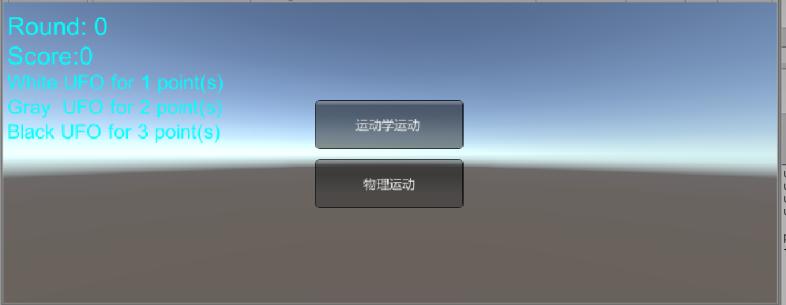
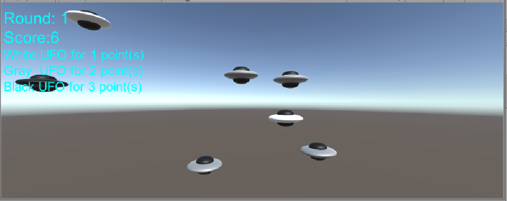

## 作业与练习        
### 1、改进飞碟（Hit UFO）游戏：
游戏内容要求： 
按 adapter模式 设计图修改飞碟游戏 
使它同时支持物理运动与运动学（变换）运动 

UI界面：

改进的地方如下：

1.将Base中关于action的部分提出来，单独建立action_Adapter.cs，首先定义interface接口。
~~~java
public interface UFO_action
    {
        void SetSpeed(int speed);
        void Start();
        void Running(bool run);
        GameObject getUFO();
        void setUFO(GameObject ufo);
        void Update();
    }
~~~

2.在原来的action中实现接口函数
~~~java
	public void SetSpeed(int speed)
        {
            this.speed = speed;
        }
        public void Running(bool run)
        {
            this.running = run;
        }
        public GameObject getUFO()
        {
            return this.ufo;
        }
        public void setUFO(GameObject ufo)
        {
            this.ufo = ufo;
        }
~~~

3.将原来factory中的函数调用进行修改，使得与adapter适应。此时游戏可以正常运行
~~~java
public void hitted(GameObject g)
	{
		if (g.gameObject.GetComponent<MeshRenderer>().material.color==Color.white) {
			//Debug.Log ("1");
			score += 1;
		} else if (g.gameObject.GetComponent<MeshRenderer>().material.color==Color.gray) {
			//Debug.Log ("2");
			score += 2;
		} else if (g.gameObject.GetComponent<MeshRenderer>().material.color==Color.black) {
			//Debug.Log ("3");
			score += 3;
		}
		this.used.Remove(g);
		g.transform.position = new Vector3(0, -20, 0);
		for(int i = 0; i < 10; i++)
		{
			if (Act[i].getUFO() == g)
				Act [i].Running (false);
		}
		this.notUsed.Add(g);
	}
	public void miss(GameObject g)
	{
		this.used.Remove(g);
		g.transform.position = new Vector3(0, -20, 0);
		for (int i = 0; i < 10; i++)
		{
			if (Act[i].getUFO() == g)
				Act [i].Running (false);
		}
		this.notUsed.Add(g);
	}

	public void newRound(int round)
	{
		for(int i = 0; i < 10; i++)
		{
			used.Add(notUsed[0]);
			notUsed.Remove(notUsed[0]);
			Act[i].SetSpeed(round + 2);
			Act[i].Start();
			Act [i].Running (true);
		}
	}
~~~

4.加入物理运动action
~~~java
 public class physics_actions : ScriptableObject, UFO_action
    {
        public director director;
        public GameObject ufo;
        Vector3 start;
        Vector3 end;
        public int speed = 5;
        public bool running = true;
        int framecount = 0;
        public int recordType;

		public void SetSpeed(int speed)
		{
			this.speed = speed;
		}
		public void Running(bool run)
		{
			this.running = run;
		}
		public GameObject getUFO()
		{
			return this.ufo;
		}
		public void setUFO(GameObject ufo)
		{
			this.ufo = ufo;
		}

        public void Start()
        {
            //Debug.Log("phy");
            director = director.getInstance();
            if (ufo.GetComponent<Rigidbody>() == null)
                ufo.AddComponent<Rigidbody>();
            start = new Vector3(Random.Range(-6, 6), Random.Range(-6, 6), 0);
            if (start.x < 10 && start.x > -10)
                start.x *= 5;
            if (start.y < 10 && start.y > -10)
                start.y *= 5;
			end = new Vector3(-start.x, -start.y, 0);
            ufo.transform.position = start;
            foreach (Transform child in ufo.transform)
            {
                child.gameObject.GetComponent<MeshRenderer>().material = Material.Instantiate(Resources.Load("Prefabs/tough", typeof(Material))) as Material;
            }
            int typeOfUFO = Random.Range(1, 4);
            recordType = typeOfUFO;
            switch (typeOfUFO)
            {
                case 1:
                    //ufo.tag = "easy";
                    //ufo.GetComponent<MeshRenderer>().material =Material.Instantiate(Resources.Load("Prefabs/easy", typeof(Material))) as Material;
                    ufo.GetComponent<MeshRenderer>().material.color = Color.white;
                    break;
                case 2:
                    //ufo.tag = "middle";
                    //ufo.GetComponent<MeshRenderer>().material = Material.Instantiate(Resources.Load("Prefabs/middle", typeof(Material))) as Material;
                    ufo.GetComponent<MeshRenderer>().material.color = Color.gray;
                    break;
                case 3:
                    //ufo.tag="tough";
                    //ufo.GetComponent<MeshRenderer>().material = Material.Instantiate(Resources.Load("Prefabs/tough", typeof(Material))) as Material;
                    ufo.GetComponent<MeshRenderer>().material.color = Color.black;
                    break;
                default:
                    break;
            }
            Rigidbody rigit = ufo.GetComponent<Rigidbody>();
            rigit.velocity = (end - start) * speed * Random.Range(0.001f, 0.06f);
			rigit.useGravity = false;
        }

        public void Update()
        {
            framecount++;
            if (framecount > 1000)
                this.director.currentController.factory.miss(this.ufo);

            Rigidbody rigit = ufo.GetComponent<Rigidbody>();
            if (running == false)
            {
                rigit.velocity = Vector3.zero;
                framecount = 0;
            }
            if (ufo.transform.position.x < -100 || ufo.transform.position.x > 100 || ufo.transform.position.x < -100 || ufo.transform.position.x > 100 || ufo.transform.position.x < -100 || ufo.transform.position.x > 100)
			{
                rigit.velocity = Vector3.zero;
                this.director.currentController.factory.miss(this.ufo);
            }
        }
    }
~~~

6.修改UI和factory中相关函数
~~~java
//UserInterface.cs
if (start)
        {
            if (GUI.Button(new Rect(0.5f * Screen.width-75, 0.5f * Screen.height - 55, 150, 50), "运动学运动"))
            {
                start = false;
                _director.currentController.factory.physics = false;
                _director.currentController.factory.enabled = true;
            }
            if (GUI.Button(new Rect(0.5f * Screen.width - 75, 0.5f * Screen.height+5, 150, 50), "物理运动"))
            {
                start = false;
                _director.currentController.factory.physics = true;
                _director.currentController.factory.enabled = true;
            }
        }
~~~

~~~java
//UFOfactory.cs
  if (physics)
        {
            for (int i = 0; i < 10; i++)
            {
                Act.Add(physics_actions[i]);
            }
        }
        else
        {
            for (int i = 0; i < 10; i++)
            {
                Act.Add(actions[i]);
            }
        }
        for (int i = 0; i < 10; i++)
		{
            Act[i].setUFO(notUsed[i]);
            Act[i].Start();
        }
~~~
