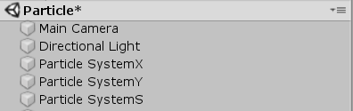
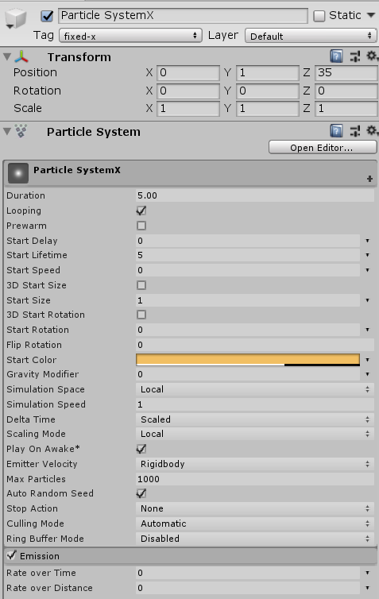
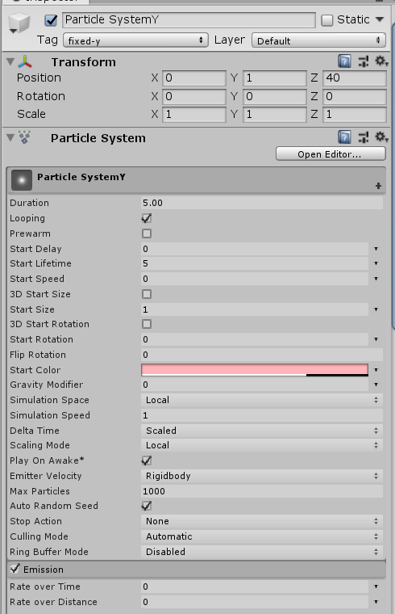
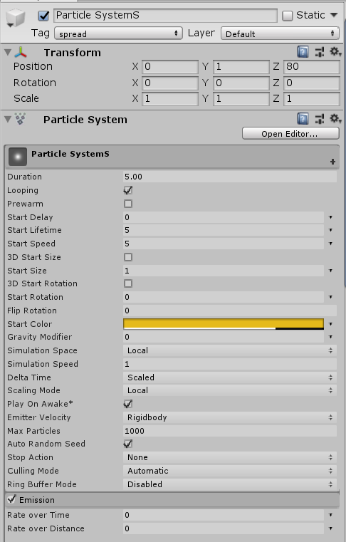
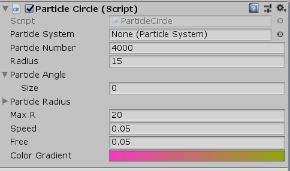
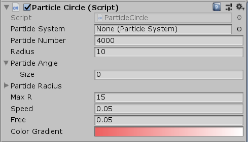
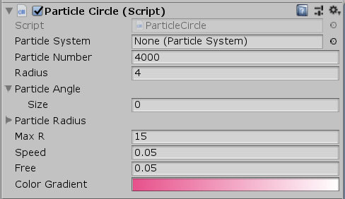
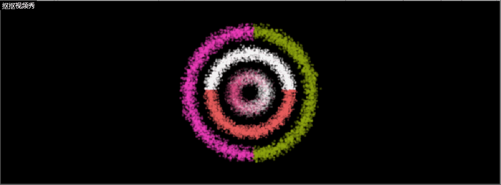
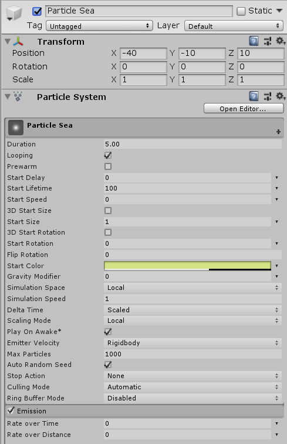
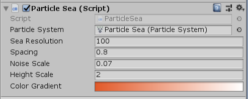

## 粒子系统
### 参考 http://i-remember.fr/en 这类网站，使用粒子流编程控制制作一些效果， 如“粒子光环”
#### 制作粒子光环
* 选择GameObject->Effects->Particle System.重复三次，分别命名为Particle SystemX,Particle SystemY,Particle SystemS.

* 在各个视图设置初始位置和粒子系统属性（注意tag，每个视图增加了tag，方便脚本可以同时操作3个对象） 
  
|  Particle SystemX   | Particle SystemY  | ParticleSystemS |
|  :----:  | :----: |  :-----:           |
|   |  |     |

* 新建一个脚本，命名为ParticleCircle,制作粒子环：
  ~~~java
  using UnityEngine;
  using System.Collections;

  public class ParticleCircle : MonoBehaviour
  {
    public ParticleSystem particleSystem;
    private ParticleSystem.Particle[] particlesArray;
    public int particleNumber = 4000;
    public float radius = 4.0f;
    public float[] particleAngle;
    public float[] particleRadius;
    public float maxR = 10f;
    public float speed = 0.05f;
    float time = 0;
    public float free = 0.05f;  //粒子浮动的范围
    public Gradient colorGradient;

    void Start()
    {
        //粒子系统的初始化设置
        particleSystem = GetComponent<ParticleSystem>();
        particlesArray = new ParticleSystem.Particle[particleNumber];   //初始化例子数组
        particleSystem.maxParticles = particleNumber;   //设置粒子最大数
        particleAngle = new float[particleNumber];
        particleRadius = new float[particleNumber];

        particleSystem.Emit(particleNumber);
        particleSystem.GetParticles(particlesArray);
        //设置粒子初始位置
        for (int i = 0; i < particleNumber; i++)
        {
            float angle = Random.Range(0.0f, 360.0f);   //随机角度
            float rad = angle / 180 * Mathf.PI; //角度和弧度的转换
            float midR = (maxR + radius) / 2;
            //最大最小半径的随机缩放
            float rate1 = Random.Range(1.0f, midR / radius);
            float rate2 = Random.Range(midR / maxR, 1.0f);
            float r = Random.Range(radius * rate1, maxR * rate2);

            particleAngle[i] = angle;
            particleRadius[i] = r;
            particlesArray[i].position = new Vector3(r * Mathf.Cos(rad), r * Mathf.Sin(rad), 0.0f);//为每个粒子坐标赋值
                                                                                                   //沿x轴上色 Spread
            if (this.tag == "spread")
                particlesArray[i].color = colorGradient.Evaluate((int)particlesArray[i].position.x);
        }
        particleSystem.SetParticles(particlesArray, particlesArray.Length);
    }
    void Update()
    {
        for (int i = 0; i < particleNumber; i++)
        {
            if (i % 2 == 0)
            {
                particleAngle[i] += speed * (i % 5 + 1);
            }
            else
            {
                particleAngle[i] -= speed * (i % 5 + 1);
            }
            if (particleAngle[i] > 360)
                particleAngle[i] -= 360;
            if (particleAngle[i] < 0)
                particleAngle[i] += 360;
            particleRadius[i] += (Mathf.PingPong(time, free) - free / 2.0f);
            time += Time.deltaTime;
            time %= 100;
            float rad = particleAngle[i] / 180 * Mathf.PI;
            particlesArray[i].position = new Vector3(particleRadius[i] * Mathf.Cos(rad), particleRadius[i] * Mathf.Sin(rad), 0f);
            //沿x轴上色 fixed
            if (this.tag == "fixed-x")
                particlesArray[i].color = colorGradient.Evaluate((int)particlesArray[i].position.x);
            //沿y轴上色 fixed
            if (this.tag == "fixed-y")
                particlesArray[i].color = colorGradient.Evaluate((int)particlesArray[i].position.y);
        }
        particleSystem.SetParticles(particlesArray, particleNumber);
    }

  }
  ~~~
* 将脚本挂载到3个粒子对象上，修改参数。
  
|Particle SystemX|Particle SystemY|Particle SystemS|
|:----:|:----:|:-----:|
||||

运行效果：

#### 制造粒子海洋
* 选择GameObject-> Effects -> Particle system,生成粒子系统，将其命名为Particle Sea.
* 同样修改位置和属性信息：

* 新建一个脚本，命名为ParticleSea,编写脚本：
~~~java
using UnityEngine;
using System.Collections;

public class ParticleSea : MonoBehaviour
{

    public ParticleSystem particleSystem;
    private ParticleSystem.Particle[] particlesArray;

    public int seaResolution = 50;

    public float spacing = 0.5f;
    public float noiseScale = 0.2f;
    public float heightScale = 3f;
    private float perlinNoiseAnimX = 0.01f;
    private float perlinNoiseAnimY = 0.01f;
    public Gradient colorGradient;

    void Start()
    {
        particlesArray = new ParticleSystem.Particle[seaResolution * seaResolution];
        particleSystem.maxParticles = seaResolution * seaResolution;
        particleSystem.Emit(seaResolution * seaResolution);
        particleSystem.GetParticles(particlesArray);
    }

    public void GetParticles(ParticleSystem.Particle[] particlesArray)
    {
        for (int i = 0; i < seaResolution; i++)
        {
            for (int j = 0; j < seaResolution; j++)
            {
                float zPos = Mathf.PerlinNoise(i * noiseScale, j * noiseScale) * heightScale;
                particlesArray[i * seaResolution + j].position = new Vector3(i * spacing, zPos, j * spacing);
            }
            particleSystem.SetParticles(particlesArray, particlesArray.Length);
        }

    }

    void Update()
    {
        for (int i = 0; i < seaResolution; i++)
        {
            for (int j = 0; j < seaResolution; j++)
            {
                float zPos = Mathf.PerlinNoise(i * noiseScale + perlinNoiseAnimX, j * noiseScale + perlinNoiseAnimY) * heightScale;
                particlesArray[i * seaResolution + j].color = colorGradient.Evaluate(zPos);
                particlesArray[i * seaResolution + j].position = new Vector3(i * spacing, zPos, j * spacing);
            }
        }

        perlinNoiseAnimX += 0.01f;
        perlinNoiseAnimY += 0.01f;

        particleSystem.SetParticles(particlesArray, particlesArray.Length);
    }

}

~~~ 

* 将脚本挂载到Particle Sea上，修改参数

* 运行，效果如下：

