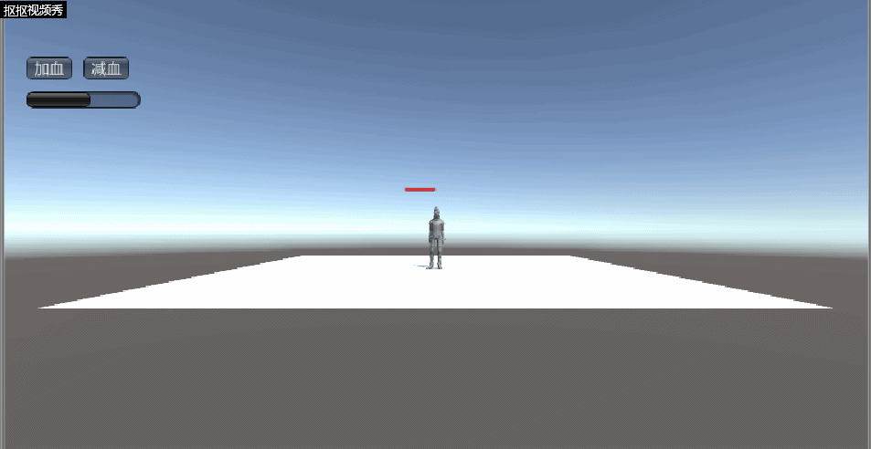
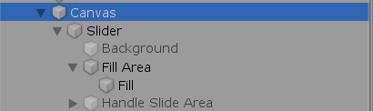
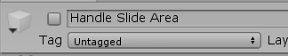
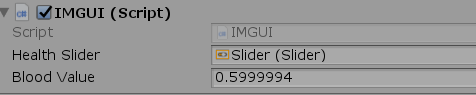

# Health bar
>血条（Health Bar）的预制设计。具体要求如下
> * 分别使用 IMGUI 和 UGUI 实现
> * 使用 UGUI，血条是游戏对象的一个子元素，任何时候需要面对主摄像机
> * 分析两种实现的优缺点
> * 给出预制的使用方法

先给出总的演示： 

## IMGUI
思路大致如下： 
* 利用水平滚动条的宽度表示血条 
  ` GUI.HorizontalScrollbar(rctBloodBar, 0.0f, bloodValue, 0.0f, 1.0f);`
* 插值计算血量变化值，使得血条变化较为平滑而非突变。
* 根据按钮`加血` `减血`改变水平滚动条宽度
  总的代码如下：
~~~java
using System.Collections;
using UnityEngine.UI; // Required when Using UI elements.
using System.Collections.Generic;
using UnityEngine;

public class IMGUI : MonoBehaviour
{
    public Slider healthSlider;

    public float bloodValue = 0.5f;
    private float ResultValue;
    private Rect rctBloodBar;
    private Rect rctUpButton;
    private Rect rctDownButton;
    private bool onoff;

    void Start()
    {
        //血条横向  
        rctBloodBar = new Rect(20,80, 100, 25);
        //加血-按钮  
        rctUpButton = new Rect(20, 50, 40, 20);
        //减血-按钮  
        rctDownButton = new Rect(70, 50, 40, 20);
        ResultValue = bloodValue;
    }

    void OnGUI()
    {
        healthSlider.value = bloodValue;
        if (GUI.Button(rctUpButton, "加血"))
        {
            ResultValue += 0.1f;
        }
        if (GUI.Button(rctDownButton, "减血"))
        {
            ResultValue -= 0.1f;
        }
        if (ResultValue > 1.0f)
        {
            ResultValue = 1.0f;
        }
        if (ResultValue < 0.0f)
        {
            ResultValue = 0.0f;
        }
        //插值计算HP值

        bloodValue = Mathf.Lerp(bloodValue, ResultValue, 0.05f);
        Debug.Log(bloodValue);
        GUI.HorizontalScrollbar(rctBloodBar, 0.0f, bloodValue, 0.0f, 1.0f);
    }
}
~~~
实现：直接将cs文件拖到MainCamera就行。 
其中 `public Slider healthSlider;`相关的是与UGUI制作相关，为了方便，我两个合在一起写了 

## UGUI
### 预制实现
根据老师教程，我稍微改改 
* 菜单 Assets -> Import Package -> Characters 导入资源
* 在层次视图，Context 菜单 -> 3D Object -> Plane 添加 Plane 对象
* 资源视图展开 Standard Assets :: Charactors :: ThirdPersonCharater :: Prefab
* 将 ThirdPersonController 预制拖放放入场景，改名为 Ethan
检查以下属性
  * Plane 的 Transform 的 Position = (0,0,0)
  * Ethan 的 Transform 的 Position = (0,0,0)
  * Main Camera 的 Transform 的 Position = (0,1,-10)
  
* 选择 Ethan 用上下文菜单 -> UI -> Canvas, 添加画布子对象
* 选择 Ethan 的 Canvas，用上下文菜单 -> UI -> Slider 添加滑条作为血条子对象

* 选择 Ethan 的 Canvas，在 Inspector 视图
  * 设置 Canvas 组件 Render Mode 为 World Space
  * 设置 Rect Transform 组件 (PosX，PosY，Width， Height) 为 (0,2,160,20)
  * 设置 Rect Transform 组件 Scale （x,y） 为 (0.01,0.01)

* 展开 Slider
  * 选择 Handle Slider Area，禁灰（disable）该元素
  * 选择 Background，禁灰（disable）该元素
  
  
  * 选择 Fill Area 的 Fill，修改 Image 组件的 Color 为 红色
  * 选择 Slider 的 Slider 组件
     * 设置 MaxValue 为 100
     * 设置 Value 为 75

* 给 Canvas 添加以下脚本 LookAtCamera.cs,以便血条一直面向主摄像机
~~~java
  using UnityEngine;

 public class LookAtCamera : MonoBehaviour
 {

    void Update()
    {
        this.transform.LookAt(Camera.main.transform.position);
    }
}
  ~~~
  
* 将Slider拖到IMGUI变量中
  

* 代码解释，在IMGUI基础上增加一个变量： 
  `public Slider healthSlider;` 
  为了做到同步，在`start()`里设置Slider值 
  `   ResultValue = bloodValue;` 
  在`OnGUI()`中，设置同步变化： 
  `healthSlider.value = bloodValue;`

  ### 两种方法实现的优缺点
  * IMGUI的好处是不需要预制血框和血条，直接用Rect在代码中实现，显得简单明了，缺点是这样做没办法自定义血框血条的外形，比较单一。
  * UGUI的好处是可以制作出更加美观的血条，缺点就是制作一个精细的血框还是需要调整一会的，而且在与代码的对接上没那么简洁。