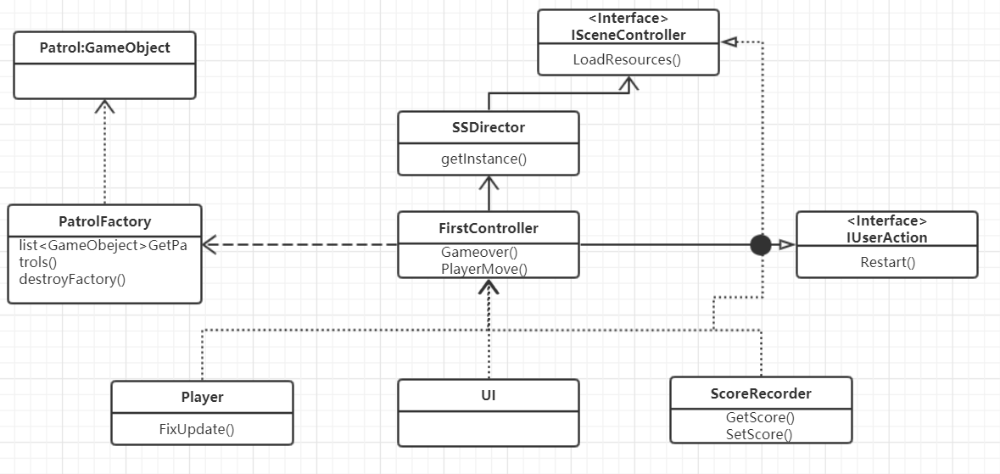
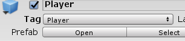
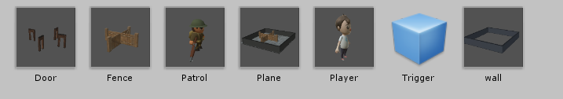

## 作业与练习
### 1、智能巡逻兵
~~~c
提交要求：
游戏设计要求：
创建一个地图和若干巡逻兵(使用动画)；
每个巡逻兵走一个3~5个边的凸多边型，位置数据是相对地址。即每次确定下一个目标位置，用自己当前位置为原点计算；
巡逻兵碰撞到障碍物，则会自动选下一个点为目标；
巡逻兵在设定范围内感知到玩家，会自动追击玩家；
失去玩家目标后，继续巡逻；
计分：玩家每次甩掉一个巡逻兵计一分，与巡逻兵碰撞游戏结束；
程序设计要求：
必须使用订阅与发布模式传消息
subject：OnLostGoal
Publisher: ?
Subscriber: 
~~~

### 成品图

### 游戏UML图

### 游戏实现
> 建立场景：在asserts store 下载wall,floor,fence等外景资源，与 trigger,plane一起拼接构建背景预制。下载人物士兵资源。改下各预制属性(注意要将玩家的tag改为player的untagged) 
>     
> 预制资源：
>  
> 将light改为spotlight,修改参数。建立一个空对象。 
>      
>将代码贴到不同的物件下,这里打开工程文件就可以看到。

#### 代码分析：
本次项目采用C#的委托，事件实现用了发布与订阅模式，通俗来讲，订阅者把自己想订阅的事件注册到调度中心，当该事件触发时候，发布者发布该事件到调度中心（顺带上下文），由调度中心统一调度订阅者注册到调度中心的处理代码。 
比如有个界面是实时显示天气，它就订阅天气事件（注册到调度中心，包括处理程序），当天气变化时（定时获取数据），就作为发布者发布天气信息到调度中心，调度中心就调度订阅者的天气处理程序. 
本篇会在后续代码中提及：

>由于SSDirector，IUserAction，和ISceneController模型跟之前差不多，不多讲

>Patrol:
>>patrol.cs
>>介绍了patrol相关属性
   ~~~java
    public enum PatrolState { PATROL,FOLLOW};//judge whether the patrol follows 
    public int sign;        //the patrol in which area
    public bool isFollowPlayer = false;
    public GameObject player=null;       //the player
    public Vector3 startPos,nextPos;
    private float minPosX,minPosZ;  // the range of this patrol can move;
    private bool isMoving = false;
    private float distance;
    private float speed = 1.2f;
    PatrolState state = PatrolState.PATROL;
   ~~~
>>patrol方法，跟随和不跟随的
  ~~~java 
   public void GoPatrol() //patrol aimlessly
    {
        if (isMoving)
        {
            transform.position = Vector3.MoveTowards(this.transform.position, nextPos, speed * Time.deltaTime);
            distance = Vector3.Distance(this.transform.position, nextPos);
            if(distance < 0.5)
            {
                isMoving = false;
            }
            return;
        }
        float posX = Random.Range(0f, 5f);
        float posZ = Random.Range(0f, 5f);
        nextPos = new Vector3(minPosX+posX, 0, minPosZ+posZ);
        isMoving = true;    
    }

    public void Follow()//chase the player
    {
        if(player != null)
        {
            nextPos = player.transform.position;
            transform.position = Vector3.MoveTowards(this.transform.position, nextPos, speed * Time.deltaTime);
        }
    }
  ~~~
>PatrolFactory.cs: 
>克隆并生产Patrol 
>属性：
~~~java
    private List<GameObject> used = new List<GameObject>();    // the used patrol
    private Vector3[] PatrolPos = new Vector3[3];
    private bool isProduce = false;
    FirstController firstController;
~~~
>关键代码部分：
~~~java
 for (int i = 0; i < 3; i++)
            {
                GameObject patrol = Instantiate(Resources.Load<GameObject>("Prefabs/Patrol"));
                patrol.transform.parent = firstController.plane.transform;
                patrol.transform.position = PatrolPos[i];
                patrol.GetComponent<Patrol>().sign = i + 1;
                patrol.GetComponent<Patrol>().startPos = PatrolPos[i];
                used.Add(patrol);
            }
~~~

>player.cs 
>介绍了player属性，将player设置为刚体等
~~~java
        gameObject.GetComponent<Rigidbody>().freezeRotation = true;
        gameObject.GetComponent<Rigidbody>().velocity = new Vector3(0, 0, 0);
~~~

### 发布与订阅模式
有两个地方 
1.AreaCollide.cs  定义事件：
~~~java
public delegate void CanFollow(int state,bool isEnter);
public static event CanFollow canFollow;
~~~
事件观察者由巡逻兵来完成，巡逻兵要时刻注意player，判断是否follow，所以巡逻兵要订阅或者说注册该事件。Patrol.cs
~~~java
AreaCollide.canFollow += changeStateToFollow;
public void changeStateToFollow(int sign_,bool isEnter)
    {
        if(sign == sign_ )
        {
            if (isEnter)
            {
                state = PatrolState.FOLLOW;
                player = (SSDirector.getInstance().currentScenceController as FirstController).player;
                isFollowPlayer = true;
            }           
            else
            {
                isFollowPlayer = false;
                state = PatrolState.PATROL;
                player = null;
                isMoving = false;
            }
        }
        
    }
}
~~~

2.记分事件，当player逃脱Patrol追捕之后，要进行积分，这个交给记分员来执行。
~~~java
//AreaCollide.cs
   public delegate void AddScore();
    public static event AddScore addScore ;
~~~

~~~java
//ScoreRecorder.cs
void SetScore()
    {
        Score++;
    }
    // Use this for initialization  
    void Start()
    {
        AreaCollide.addScore += SetScore;//订阅事件  
    }
~~~